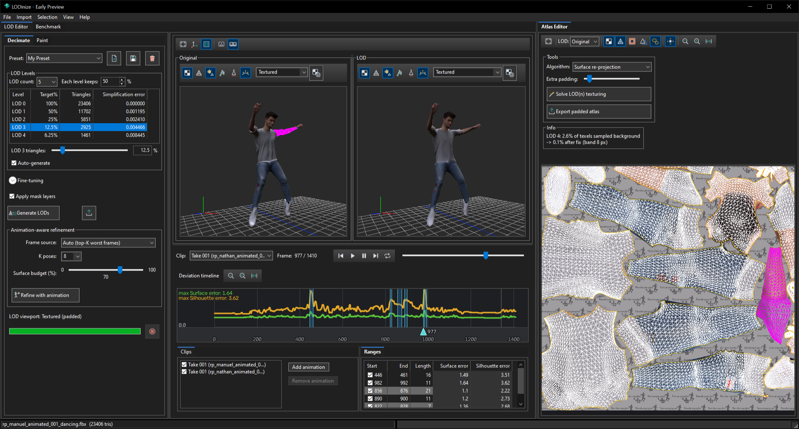

### 👋 Stefan Sarnev
Founder of **Sarnea Solutions Inc.** (Vancouver, Canada).

**[LODinize](https://www.lodinize.com)** is a Windows tool that makes level-of-detail meshes for skinned, animated characters. It checks every LOD on every frame of your animations, shows where it breaks, and helps you fix it before you export to Unreal, Unity or any engine that reads FBX.

🚀 **The free Early Preview is out:** [download](https://www.lodinize.com/download/) · [docs](https://www.lodinize.com/help/v1.0/) · [send feedback](https://www.lodinize.com/feedback/)

Characters: the free [Animated People](https://renderpeople.com/free-3d-people/) by RenderPeople.

Built in C++ with OpenCV, wxWidgets, bgfx and meshoptimizer.

Proud sponsor of [OpenCV](https://github.com/sponsors/opencv). 💙
